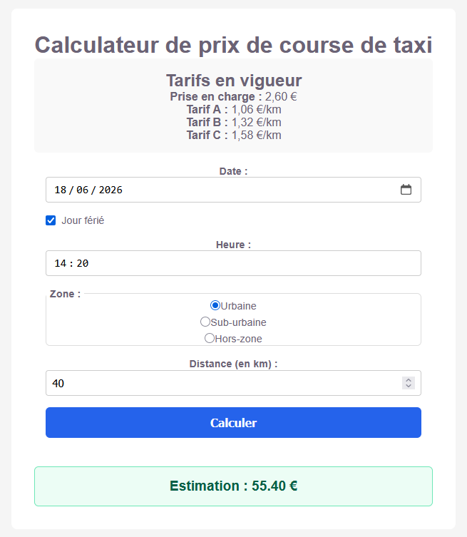

# Calculateur tarifs taxis

## Compétence abordées

Algorithmique :
- utilisation de structures de contrôle conditionnelles
- utilisation d'opérateurs mathématiques

Test unitaires :
- [développement TDD](https://gayerie.dev/docs/testing/test/tdd.html)

Développement ReactJS :
- utilisation de "ref" pour récupération/manipulation d'éléments du DOM
- manipualtion d'états

## Travail à effectuer

1. développer le jeu de test pour le tarif en "Hors zone"
2. développer la logique de la fonction `export function calculateFare(jourSemaine, hour, zone, distance, estFerie)` en TDD
3. compléter le code buggué du composant JSX pour rendre l'application fonctionnelle

## Objectifs

Vous intervenez sur le développement d'une application dédiées aux chauffeurs de taxis.

L'objectif est de livrer une application JS qui permet aux utilisateurs de faire une estimation du tarif d'une course en fonction de critères qu'ils pourront saisir via un formulaire.

Voici un apperçu de l'interface graphique :



> [!NOTE]  
> L'application n'est pas encore pleinement fonctionnelle.
>
> Ce dépôt contient le code à compléter afin d'implémenter la méthode de calcul.
>
> Lisez la suite de ce `README.md` pour en apprendre plus.

## Règles tarifaires

3 tarifs au kilomètres sont applicables :
- Tarif A (1,06 €/km) ;
- Tarif B (1,32 €/km) ;
- Tarif C (1,58 €/km).

De plus, 3 zones peuvent être desservies par les chaffeurs :
- Zone urbaine ;
- Zone suburbaine ;
- Hors zone suburbaine.

Le tableau suivant récapitule les différentes règles tarifaires :

|  | Tarif A (1,06 €/km) | Tarif B (1,32 €/km) | Tarif C (1,58 €/km) |
|--------------|---------------------|---------------------|---------------------|
| **Zone urbaine** | Lundi au Samedi : 10h00 - 17h00 | Lundi au Samedi : 17h00 - 10h00<br>Dimanche : 07h00 - 00h00<br>Jours fériés : 00h00 - 24h00 | Dimanche (y compris fériés) : 00h00 - 07h00 |
| **Zone suburbaine** | - | Lundi au Samedi : 07h00 - 19h00 | Lundi au Samedi : 19h00 - 07h00<br>Dimanche (y compris fériés) : 00h00 - 24h00 |
| **Hors zone** | - | - | Toute heure, tous les jours |

**Note** : La prise en charge est de **2,60 €** pour toutes les courses, quelle que soit la zone ou le tarif appliqué.

## Démarrer le projet en environnement de développement

1. Installer les dépendances JS :
```bash
npm install
```

2. Lancement le serveur de développement :
```bash
npm run dev
```

## Démarrer les tests unitaires

Commande pour démarrer les tests unitaires :
```sh
npm run test
```

## Travail à effectuer

Implémenter la fonction:
```js
export function calculateFare(jourSemaine, hour, zone, distance, estFerie)
```
du fichier `srcc/taxiFareCalculator.js` avec une approche [TDD](https://www.coursera.org/fr-FR/articles/test-driven-development).
